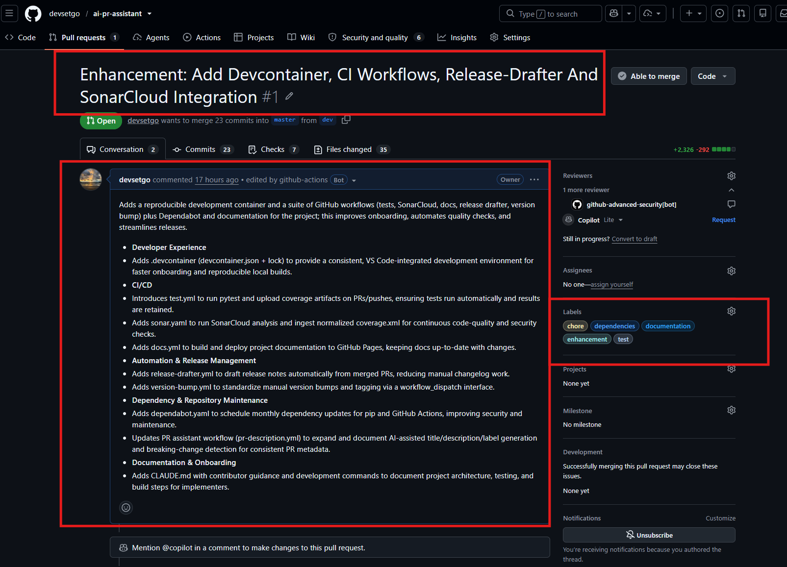
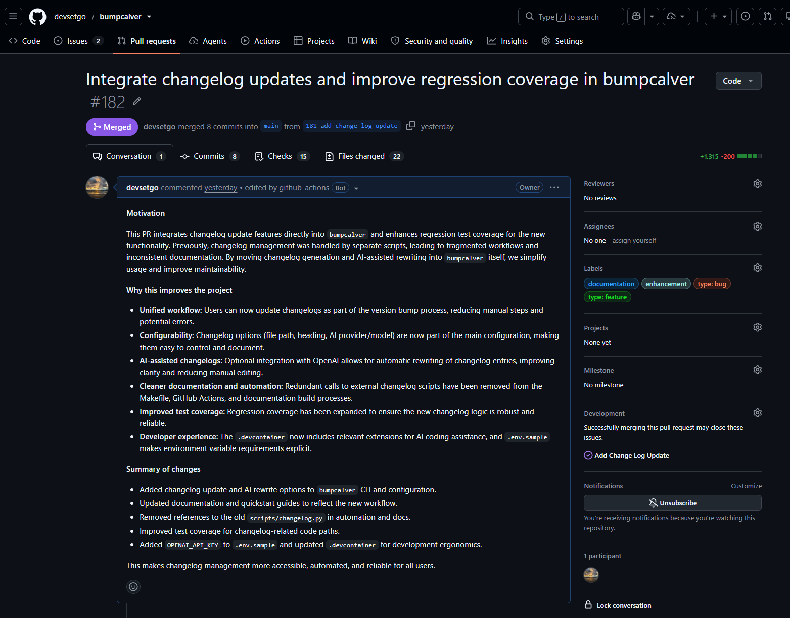
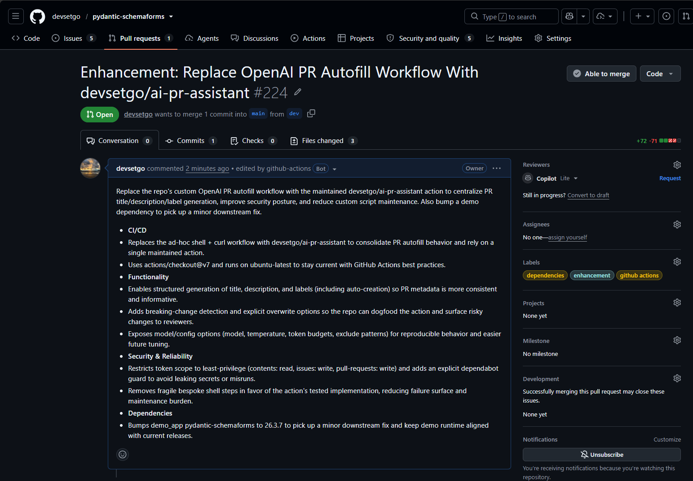

# `devsetgo/ai-pr-assistant` GitHub Action

[](https://github.com/devsetgo/ai-pr-assistant/actions/workflows/test.yml)
[](https://github.com/devsetgo/ai-pr-assistant/actions/workflows/test.yml)
[](https://sonarcloud.io/summary/new_code?id=devsetgo_ai-pr-assistant)
[](https://sonarcloud.io/summary/new_code?id=devsetgo_ai-pr-assistant)
[](https://sonarcloud.io/summary/new_code?id=devsetgo_ai-pr-assistant)
[](https://sonarcloud.io/summary/new_code?id=devsetgo_ai-pr-assistant)
[](https://sonarcloud.io/summary/new_code?id=devsetgo_ai-pr-assistant)
[](https://sonarcloud.io/summary/new_code?id=devsetgo_ai-pr-assistant)

Autofill the description (and optionally the title and labels) of your pull requests with the power of OpenAI or Claude!

Inspired by the excellent work of [`platisd/openai-pr-description`](https://github.com/platisd/openai-pr-description)
by Dimitris Platis, this project has since gone in its own direction —
substantially updated for current OpenAI models (including the `gpt-5`
family) and extended with optional title generation, auto-labeling and
breaking-change detection. See the [migration guide](docs/MIGRATING.md) for
its history and how it differs from upstream.



## What does it do?

`ai-pr-assistant` is a GitHub Action that looks at the title as well as the contents
of your pull request and uses the [OpenAI API](https://openai.com/blog/openai-api) (or Claude, via the
[Anthropic API](https://platform.claude.com/docs/en/api/overview)) to automatically
fill up the description of your pull request. Just like ChatGPT would! 🎉<br>
The Action tries to focus on **why** the changes are needed rather on **what** they are,
like any proper pull request description should.

By default it only runs when a PR description is not already provided, so it
will never accidentally overwrite an existing one unless you opt in via
`overwrite_description`. You can also restrict it to only run for specific
PR authors, e.g. the repository's maintainers.

Optionally, it can also:
- propose (or apply) an improved **pull request title**
- **auto-label** the pull request from a configurable taxonomy
- flag likely **breaking changes** with a note in the description and a `breaking-change` label

All of these are opt-in and default to off, so a minimal workflow keeps the
plain-description behavior described above. Generated descriptions end with a small
`Created using devsetgo/ai-pr-assistant with <model>` footer; set `attribution: false`
to omit it. See
the [configuration reference](docs/CONFIGURATION.md) for every input and how these
features interact.

Keep in mind the OpenAI and Anthropic APIs are not free to use. That being said, so far OpenAI has been rather cheap,
i.e. around ~$0.10 for 15-20 pull requests.

## Quickstart

1. Get an API key: create an account with OpenAI, set up a payment method and get your [OpenAI API key]
   — or do the same with Anthropic to get an [Anthropic API key] for Claude. The
   [setup guide](docs/SETUP.md#get-an-api-key) has step-by-step instructions for both.
2. Add the key as a [secret] in your repository's settings, named `OPENAI_API_KEY` or `ANTHROPIC_API_KEY`.
3. Create a workflow YAML file, e.g. `.github/workflows/ai-pr-assistant.yml`:

```yaml
name: Autofill PR description

on: pull_request

jobs:
  ai-pr-assistant:
    runs-on: ubuntu-latest

    steps:
      - uses: devsetgo/ai-pr-assistant@main
        with:
          github_token: ${{ secrets.GITHUB_TOKEN }}
          openai_api_key: ${{ secrets.OPENAI_API_KEY }}
          openai_model: gpt-5-mini
          max_tokens: '2000'
          max_diff_tokens: '6000'
```

That's it — every new pull request without a description will get one.

To use Claude instead of OpenAI, set `provider: anthropic` and pass an Anthropic key
(the model defaults to `claude-haiku-4-5-20251001`; pick another with `anthropic_model`):

```yaml
      - uses: devsetgo/ai-pr-assistant@main
        with:
          github_token: ${{ secrets.GITHUB_TOKEN }}
          provider: anthropic
          anthropic_api_key: ${{ secrets.ANTHROPIC_API_KEY }}
```

## Documentation

- [**GitHub Pages site**](https://devsetgo.github.io/ai-pr-assistant/) — published docs built with Zensical
- [**Setup guide**](docs/SETUP.md) — a full-capability example workflow and a step-by-step walkthrough
- [**Configuration reference**](docs/CONFIGURATION.md) — every input, defaults,
  classic vs. structured mode, and required permissions
- [**Model reference**](docs/MODELS.md) — OpenAI and Claude models side by side (convenience only, with a
  disclaimer: check the providers for real pricing)
- [**Changelog**](docs/CHANGELOG.md)
- [**Troubleshooting**](docs/TROUBLESHOOTING.md) — the `403` error, missing
  labels, and other common issues
- [**History & migrating from `platisd/openai-pr-description`**](docs/MIGRATING.md)
- [**Action metadata (`action.yml`)**](https://github.com/devsetgo/ai-pr-assistant/blob/main/action.yml)

## Demo

These examples show the kind of developer tooling and product surfaces this project is designed to complement.

### [BumpCalver](https://github.com/devsetgo/bumpcalver)

BumpCalver is my calendar-versioning library for Python that helps manage versions while also maintaining a changelog. It keeps versioning and release notes aligned, making release management more predictable and easier to automate.



### [pydantic-schemaforms](https://github.com/devsetgo/pydantic-schemaforms)

`pydantic-schemaforms` is a modern Python library that generates dynamic HTML forms from Pydantic 2.x+ models. It is designed for server-rendered apps: you define a model and optional UI hints, and get back ready-to-embed HTML with validation and framework styling.



## License

MIT — see [LICENSE](https://github.com/devsetgo/ai-pr-assistant/blob/main/LICENSE). This project retains the original upstream
copyright notice as required by the license, alongside a copyright line for
its own modifications.

[OpenAI API key]: https://help.openai.com/en/articles/4936850-where-do-i-find-my-secret-api-key
[Anthropic API key]: https://platform.claude.com/settings/keys
[secret]: https://docs.github.com/en/actions/security-guides/encrypted-secrets
